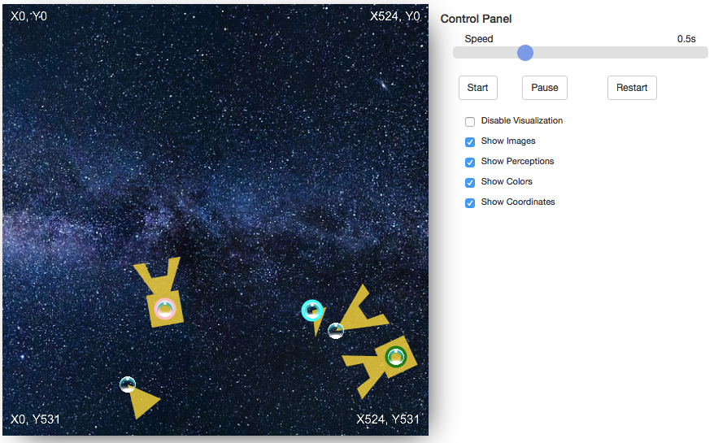
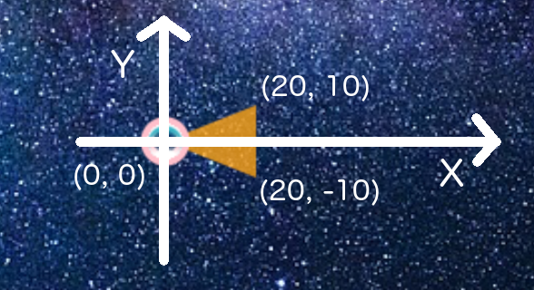

# Bobble-Tank

A little web-based simulator for multi agent interactions. Runs out of the box. Just open index.html in your web-browser.


## Herunterladen und Starten

### Herunterladen

* Entweder direkt von der Webseite herunterladen kleines **Wolkensymbol** rechts neben dem *Web IDE* Knopf weiter oben
* .. oder mit git clonen. Dafür git installieren und ```git clone https://gitlab.com/RobinSunCruiser/bobbel-tank.git``` ausführen.

### Starten
* Entweder die **index.html** direkt mit einem Webbrowser öffnen
* .. oder einen lokalen Webserver installieren zB. *mamp* und die Dateien dort ins *Web-Root*-Verzeichnis kopieren und im Browser über localhost:xyz (meist localhost:8888) öffnen

## Overview
This simulator can be used to implement little entities with sensors in a 2D-Environment.

It has a tiny API and configuration interface. The rest of the project is focused on simplicity and provides heavy documentation.

### Files
The project contains the following files..

* **doc/**		Documentation Folder
* **images/**	Folder containing Images
* **lib/**		Used libraries, such as jquery, bootstrap etc.
* **bobbeltank.core.css**	Simulators default stylesheet
* **bobbeltank.core.js**	Simulators default functionality
* **bobbeltank.js** Your javascript entry-point to add functionality
* **properties.js** Your javascript entry-point to configure parameters
* **index.html** HTML-Webpage for Layout

For you mostly relevant are:

1. **properties.js** Here you can define bobbels position, direction, sensors etc. At the end you can set simulation parameters. [Properties.js documentation](doc/properties.md)
2. **bobbeltank.js** This file contains function-bodies that are called during the simulation. Relevant information are provided as parameters. You can add your own functionality into these function-bodies. [bobbeltank.js documentation](doc/bobbeltank.md)

If you want to use additonal core functionality like painting things, change html layout etc. you can use (and if necessary rewrite) the core-files. [Bobbeltank.core.js documentation](doc/bobbeltank.core.md)

#### Tips

1. **Autorefresh on file change**: This project uses [live.js](http://livejs.com). If you use a web-server such as *mamp* to host this project and deactivate our browser cache (mostly somewhere in debug mode). Page refreshes automatically if you change something

## How to start
This section provides some brief steps how to start coding..

### Define Entities, Sensors and Parameters
Entities are defined inside **properties.js**. The variable bobbel_entities is a list filled with descriptions like this:

	var bobbel_entities = [
		
		{
	            name: "Hannah",
	            image: "images/150x150_bubble.png",
	            color: "pink",
	            position : [200,375],
	            perceptions : ["see", "hear"],
	            direction : 45
	    },...
	]

Just add new Entities to this List defining your own names, image, color, starting position, attached sensors, and direction.

To define Sensors **properties.js** contains another variable (this time an object) mapping sensor-tags (or sensor-names) to sensor definitions like this:

	var bobbel_sensors = {
	
	    see: {
	        perimeter: [[0,0], [20,10], [20,-10]],
	        color : "orange"
	    }, ...
	};
	
Sensors can have a color and need a perimeter. Perimeter define the sensed area around an entity at position (0,0) facing in X-Direction. If you don't define a color. The Sensor is invisible (but there)
**It is very important, that you define a "simple" polygon having no edges crossing each other!**



You can add perceivable edges (for walls etc.). Walls are defined in a list by a wall object containing a ```perimeter```-Array with start and endpoint, color and name.

	var bobbel_walls = [
	    {
	        perimeter: [[120,0], [120,400]],
	        color : "red",
	        name: "left_wall"
	    },{ ... }
	];


Further you can define some properties of the simulation environment. These are placed in

	var simulator_parameters = {}
	
and should be self explaining.

### Change behavior
To change behavior look into **bobbeltank.js**. The following functions are provided:

	var load_bobbel_data = function(){
	
	    /** place init code here **/
	
	    EntityCollection.setEntities(bobbel_entities, bobbel_sensors);
	
	    /** or here **/
	
	    Log.info('Initialization done!');
	};
	
This function is called once after program start and everytime you press the "restart" button on control-panel. If you want to switch between different sets of entities or sensor definitions just define them in **properties.js** using your own variable names and change them here in the ```setEntities()``` function. The Log function outputs your messages in the Control-Panel log.

The next function is called at the beginning of every simulation step. One simulation step let all entities defined perceive things and perform their actions (and updates visualisation at the end).

	var perform_simulation_step_initialization = function(entity_list, step_count){
	
	};
	
As parameters you get a entity_list. This list now contains Entity-Objects. Thes objects are the living versions of your Entities you defined in **properties.js**. And the current simulation step_count.

The next function is called during simulation once for every single entity.

	var perform_simulation_step_on_entity = function(entity, perceptions, step_count){
		// do something with entity and its perceptions here
	};
	
The parameters provided are the (living) current Entity-Object. You can read its properties, add new properties or use its methods to move and act with environment. A perceptions object (explained in Entity-Object below). It maps sensor-tags to lists of perceptions (or perceptions = null if nothing is percieved) and the step_cound for current simulation step.

The file **bobbeltank.js** should contain some template code with simple behavior.

The last function called during a simulation step can be used to clean up afterwards. It is called exactly before all painted changes are flushed to the visible canvas.

	var perform_simulation_step_finalization = function(entity_list, step_count, duration) {
	    Log.debug('Performed simulation step ' + step_count + ' for ' + duration + 'ms', 1, "simulator_performing_step");
	}
	
Again parameters provided is a list of all entities, the current simulation step count and the overall duration of this simulation in milliseconds.

## The Entity-Object
The simulator reads your entity information from variable ```bobbel_entities``` in **properties.js** and generates a living Entity-Object for every entity containing current states, positions, sensor-polygons, some helper functions etc.

### Properties
The Entity-Object contains the follwing properties you can use and change. 
If you want to store other information in a property during simulation, just use ```entity.someproperty = "whatever";```.

* ```name``` string name of an entity provided in properties.js
* ```img_src``` image path provided in properties.js
* ```color``` color provided in properties.js
* ```posX``` number with X-coordinate. If changed directly call updateSensors() on entity to update polygons
* ```posY``` number with Y-coordinate. If changed directly call updateSensors() on entity to update polygons
* ```direction``` rotation of entity in degrees (0-360) 0 is along x-axis 90 along y-axis ... If changed directly call updateSensors() on entity to update polygons
* ```sensor_colors``` object providing sensor color for every sensor. Use sensor_colors[<sensorname>] on entity
* ```sensor_polygons``` object contains calculated sensor polygons around entity based on current position and direction Use sensor_polygons[<sensorname>] on entity
* ```sensor_range``` Max distance of the sensor in any direction
* ```uuid``` generated unique-id. Use to reference entity instead of name-property if you use same name for multiple entities
* ```movementRestricted``` true if entities movement is restricted into boundaries (tank for example). false else
* ```restrictedXmin``` number if movement restricted. null else
* ```restrictedXmax``` number if movement restricted. null else
* ```restrictedYmin``` number if movement restricted. null else
* ```restrictedYmax``` number if movement restricted. null else
* ```polyk_sensor_polygons``` same object as sensor_polygons but in other format needed by library PolyK. PolyK is included in this project and helps with polygon-functions documented on their [website](http://polyk.ivank.net/?p=documentation).

### Object-Methods
These are the methods available in the Entity-Object.

* ```entity.move(distance_in_px)``` moves towards current direction and updates sensor_polygons
* ```entity.rotate(degree)``` (0-360) rotates direction counterclockwise (-degree clockwise) and updates sensors
* ```entity.updateSensors()``` if you change posX, posY or direction yourself this updates sensorpolygons for you
* ```entity.toString()``` overrides default string output method providing some debug info if necessary
* ```entity.getPerceptions(pos_list, obj_list)``` Determines for single positions and position-pairs (edges) if they are perceived by entities Sensors. If position at index is perceived it returns object with index from obj_list together with some properties depending of the perception type. Positions can contain points and edges (```[[x,y], [x,y], [[x,y],[x,y]], [x,y]]```)

#### Perception-Object
The Perception-Object is returned by the ```getPerceptions``` method. It maps *sensor_tags* to lists of perception objects. Perception can be of type *Entity-Object* or *Edge-Object* and contain different addional properties and references to perceived object. If there is absolutely no perception ```getPerceptions``` returns ```null```.
	
	{
		sensor_tag_1: [				// "see"
			{
				type: "Entity-Object" // type of perception
				position: [x, y],	// position of seen Entity-Object (from pos_list[i])
				distance: 123,		//	distance to seen Entity-Object
				direction: 45,		// direction to seen Entity-Object (0 is exactly in front of Entity)
				object: { ... }		// reference to (Entity-)Object (from obj_list[i])
			},
			{
				type : "Edge-Object"		// another seen Object this time of Edge-Type
				sensor_intersections: [[x,y],[x,y]] // intersection points of edge with edges of current sensor polygon
				object: { ... } 			// reference to object
			}, ..
		], 
		sensor_tag_2: [ ... ],		// another sensor_tag ("hear" .. etc.)
		...
	}


### Static-Functions (helpers)
* ```Entity.__rotateAroundOrigin(x, y, originX, originY, angle)``` returns rotated point with x,y around origin
* ```Entity.__distanceBetweenTwoPoints(x1, y1, x2, y2)``` returns distance between two points
* ```Entity.__angleBetweenPoints(x1, y1, x2, y2)``` returns direction between xy1 and xy2 in degrees
* ```Entity.__pointInPolygon(x, y, polygon)``` returns true if x,y are inside polygon [[x,y],[x,y],...]
* ```Entity.__doEdgesIntersect(posA1, posA2, posB1, posB2)``` returns true if two edges defined by start and endpoint intersect
* ```Entity.__getIntersectionPoint(posA1, posA2, posB1, posB2)``` returns array with [X,Y] of intersection point if two edges defined by start and endpoint intersect. Null if they do not intersect
* ```Entity.__minDistPointToEdge(pointX, pointY, startX, startY, endX, endY)``` returns minimum distance between a point and a edge defined by start and endpoint

## The Edge-Object
Is a tiny object containing the properties ```name```, ```perimeter``` and ```color```
Edges can be defined in **properties.js** and are maintained in **EdgeCollection** during simulation.

## Core functions you can use
All core functions are defined in **bobbeltank.core.js**. Its documentation can be found here [here](doc/bobbeltank.core.md). Just a brief overview about the most important ones.

### EntityCollection
Handles the Entity-Objects for you. Here you can set simulator entities, find entities or change global entity parameters.

* ```EntityCollection.setEntities(input_entities, input_sensors)``` Sets simulator entities to ```input_entities``` having ```input_senors```. The *inputs* have to look like defined in **properties.js**
* ```EntityCollection.addEntity(input_entity, input_sensors)``` Adds single entity (single *input_entity* object) to end of entity list. Additionally returns a reference to new generated Entity-Object.
* ```EntityCollection.removeEntityAtIndex(index)``` Removes Entity at given Index from List (use in finalization step)
* ```EntityCollection.removeEntityWithUUID(uuid)``` Removes Entity having given UUID from List (use in finalization step)
* ```EntityCollection.getEntities()``` Returns the list of entities currently used by the simulator
* ```EntityCollection.getPositions()``` Returns a list only containing the positions of entities used by the simulator
* ```EntityCollection.getEntityByIndex(index)``` Returns the entity at *index* position in the list used by simulator
* ```EntityCollection.getEntityByUUID(uuid)``` Every Entity-Object has its own unique ID. Returns an entity having this unique id. 

### EdgeCollection
Handles the Edge-Objects for you. Here you can set simulator edges, find edges...

* ```EdgeCollection.setWalls(input_walls)``` Sets simulator edges to ```input_edges ```. The *inputs* have to look like defined in **properties.js**
* ```EdgeCollection.addWall(input_edge)``` Adds single edge (single *input_edge* object) to end of edge list.
* ```EdgeCollection.removeWallAtIndex(index)``` Removes edge at given Index from List
* ```EdgeCollection.getEndpoints()``` Returns the list of edge endpoints currently used by the simulator [[[x,y],[x,y]],[[x,y],[x,y]],...]
* ```EdgeCollection.getEdges()``` Returns a list containing the Edge-Objects

### Tank
Is the object handling visualization processes. All operations are performed on a scratch or image canvas and transfered to visible canvas using Tank.flush()

* ```Tank.displayEntity(Entity-Object)``` paints an entity to a scratch canvas. (Called automatically after *perform_simulation_step_on_entity()*)
* ```Tank.displayEdge(startPoint, endPoint, color)``` paints edge to canvas.
* ```Tank.displayPolygon(polygon, color)``` paints (any) polygon to canvas.
* ```Tank.displayColorRing(color, posX, posY, radius)``` paints a colored circle around given point.
* ```Tank.displayImage(source, posX, posY, sizeX, sizeY)``` paints image to special image canvas (layer above scratch canvas)
* ```Tank.flush()``` Cleanes visible canvas, transfers sratch to visible, transfers image to visible, clears scratch and visible.

### Simulator
Handles simulation and simulation steps

* ```Simulator.setInterval(timespan)``` starts simulation with given intervall
* ```Simulator.stop()``` pause simulation
* ```Simulator.performStep()``` performs steps. calls perform functions in **bobbeltank.js**

### Log
Use to perform output in log. Messages can be shown for a specific amount of time (optional). Messages can be tagged (optional). New messages with a tag replace old message having the same tag. So you can create channels for fast changing outputs.

* ```Log.debug(message, sec, tag)``` Shows debug-message for *sec* seconds tagged with *tag*
* ```Log.info(message, sec, tag)``` Shows debug-message for *sec* seconds tagged with *tag*.
* ```Log.error(message, sec, tag)``` Shows debug-message for *sec* seconds tagged with *tag*.

Sec and tag are optional. You can just use ```Log.debug(message)``` or ```Log.debug(message, sec)``` if you like. Log level to hide **debug** or **info** outputs can be set in the simulation parameters in **properties.js**.
